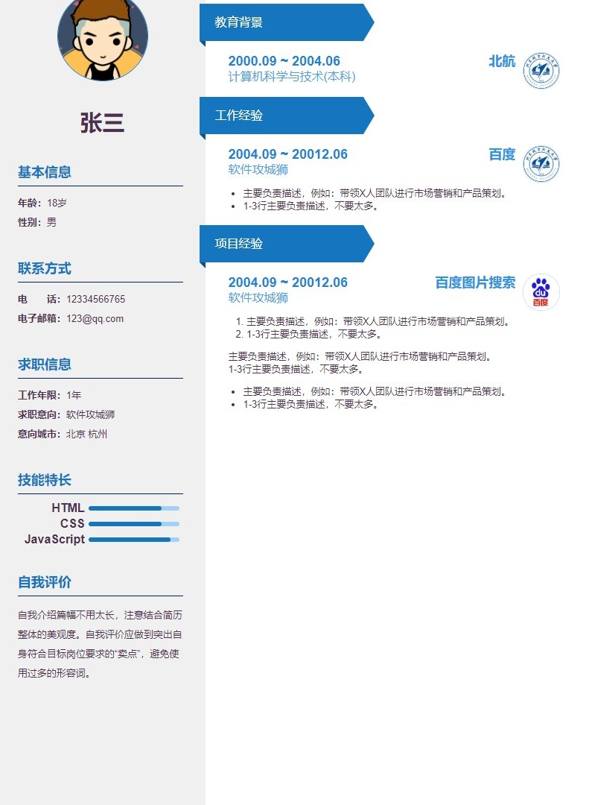

# resume

> 使用网页完成一个简历的设计，通过Chrome的打印功能将其转化为一个PDF简历文件

## 使用

更新`src/personalInfo/`文件夹下的文件中的信息即可更新简历内容

## 示例



## Project setup
```
npm install
```

### Compiles and hot-reloads for development
```
npm run serve
```

### Compiles and minifies for production
```
npm run build
```

### Run your unit tests
```
npm run test:unit
```

### Run your end-to-end tests
```
npm run test:e2e
```

### Lints and fixes files
```
npm run lint
```

### Customize configuration
See [Configuration Reference](https://cli.vuejs.org/config/).
